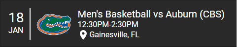

# gators-mbk-tracker



Home Assistant Lovelace card for displaying the details for the next UF basketball game using data from google calendar.

1. Add the [mens basketball calendar](http://floridagators.com/calendar.ashx/calendar.ics?sport_id=20&_=8885847f-9fc1-4876-9cc0-5d6968157fb0) to your google account and set up the [google calendar integration](https://www.home-assistant.io/integrations/calendar.google/) in Home Assistant.

2. Add the gators-mbk-tracker.js file to /config/www

3. Add the card to ui-lovelace.yaml

```
  - url: /local/gators-mbk-tracker.js?v=1.0.0.
    type: js
    
    ...

  - type: "custom:gators-mbk-tracker"
    entity: calendar.men_s_basketball_floridagators_com
```
